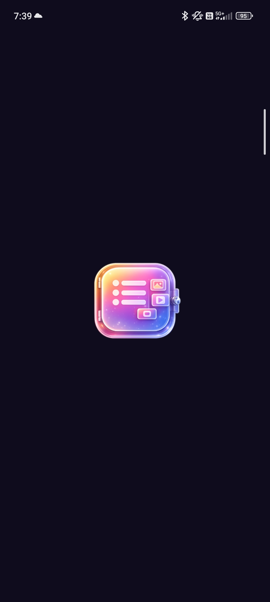
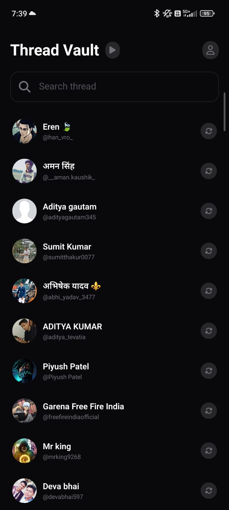
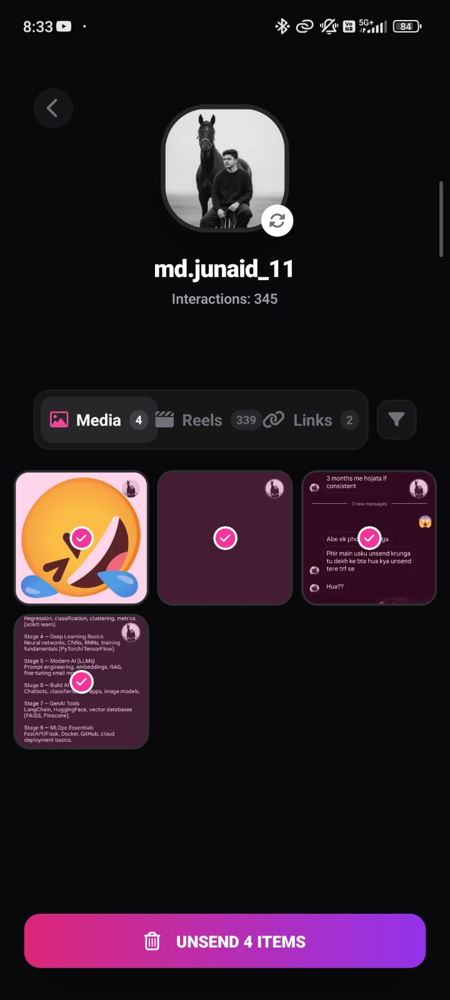
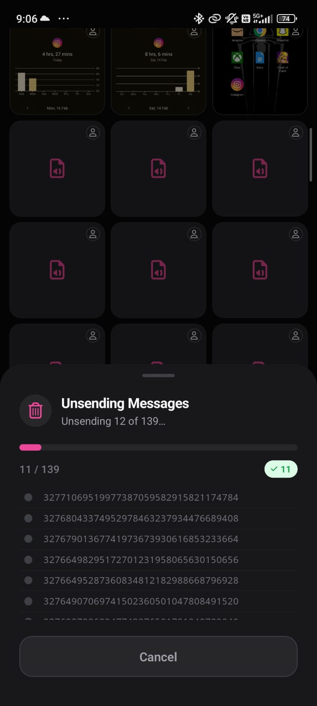
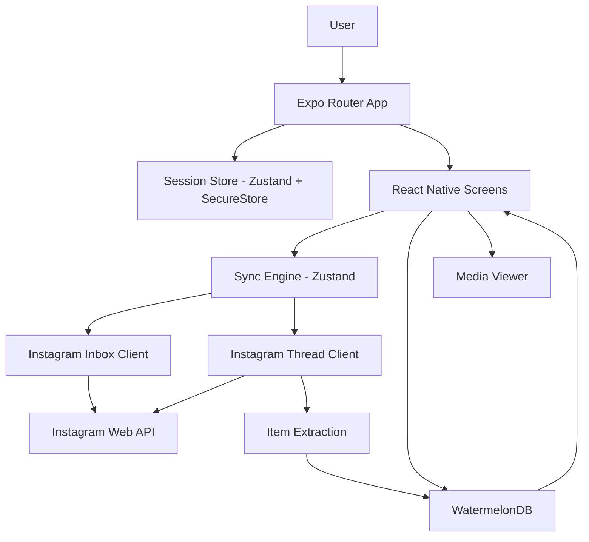
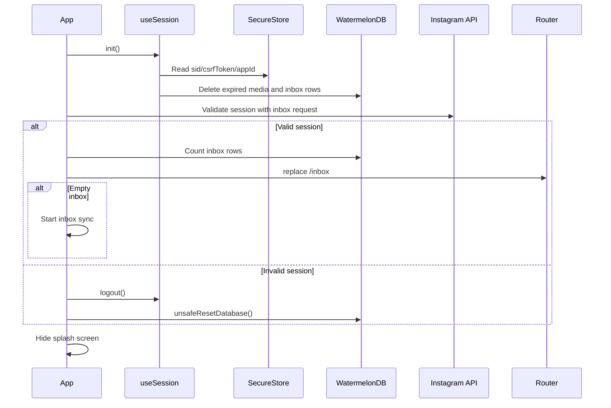
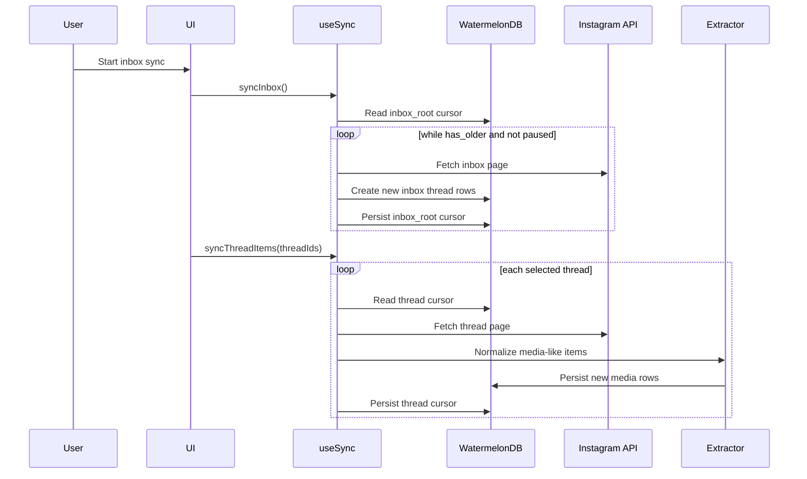

<h1>
  
  Thread Vault
</h1>

> A local-first Expo and React Native application for archiving, browsing, and managing Instagram Direct Message media.

Thread Vault is a mobile-first client that connects to Instagram using a captured session, synchronizes inbox threads and thread items, extracts media-like interactions, and stores them locally in an on-device SQLite database through WatermelonDB. It is intended for users and developers who want a private local archive of Instagram DM media, reels, links, and voice messages without a custom backend service.

## Preview

Android application preview:

<p>
  
  
  
  
</p>

## Badges


## What This Project Is

Thread Vault is an Expo Router application built for React Native and Android. It operates as a local-first Instagram DM media archive:

- Authenticates by extracting an Instagram `sessionid` cookie from an embedded WebView login flow or by accepting a manually pasted session cookie.
- Validates the session by making a lightweight Instagram inbox request.
- Crawls Instagram Direct inbox threads using cursor-based pagination.
- Crawls selected or individual threads to extract media, reels, links, animated media, and voice messages.
- Persists inbox records, extracted media, and sync cursors locally with WatermelonDB.
- Displays archived thread media in tabbed views grouped by media, reels, and links.
- Provides a full-screen viewer for images, videos, audio messages, and link content.
- Supports pausing sync work and resuming from persisted cursors.
- Performs startup cleanup for locally expired records.

The project does not include a custom backend. Network communication is performed directly from the client to Instagram web API endpoints.

## Tech Stack

### Frontend

- Expo SDK 54
- React 19
- React Native 0.81
- Expo Router 6
- React Navigation
- Nativewind 5 preview
- Tailwind CSS 4
- Expo Vector Icons / FontAwesome6
- Expo Image
- Expo AV
- Expo Linear Gradient
- React Native WebView
- React Native Gesture Handler
- React Native Reanimated
- React Native Safe Area Context
- React Native Screens
- React Native Web

### Backend

Not explicitly implemented in the repository.

### Database

- WatermelonDB
- WatermelonDB SQLite adapter
- SQLite through the native WatermelonDB adapter
- JSI-enabled database access

### Networking

- Client-side `fetch`
- Instagram web API requests
- Cookie-based Instagram session authentication
- React Native Cookie Manager
- WebView-based Instagram login session extraction

### Rendering / Graphics

- React Native native UI
- Expo Image
- Expo AV video playback
- FlashList virtualization
- Nativewind utility styling

### Physics / Simulation

Not explicitly implemented in the repository.

### Infrastructure

- Expo app configuration
- Android native project generated/prebuilt for React Native
- Gradle Android build
- GitHub Actions workflow for web export, APK build, and GitHub Pages deployment

### Tooling

- TypeScript strict mode
- Metro bundler
- Expo CLI
- npm with `package-lock.json`
- ESLint with Expo flat config
- Prettier
- Prettier Tailwind plugin
- PostCSS with Tailwind CSS plugin

### Testing

No test framework, test files, or test scripts are explicitly defined in the repository.

## Architecture Overview

Thread Vault is a client-only, local-first mobile application. Its architecture is a modular React Native client with local persistence, direct external API communication, and Zustand-powered orchestration state.

The main architectural layers are:

- **App Shell:** Expo Router root layout, splash handling, session initialization, startup validation, and route transitions.
- **Authentication Layer:** WebView login and manual session input, persisted through Expo SecureStore.
- **Networking Layer:** Instagram request helpers that attach session cookies, CSRF token, user agent, and Instagram app ID headers.
- **Sync Engine:** Zustand store that coordinates inbox sync, thread sync, pause state, progress labels, counters, and cursor persistence.
- **Extraction Layer:** Instagram item parser that maps raw Direct Message items into normalized media records.
- **Persistence Layer:** WatermelonDB models for inbox threads, extracted media, and sync cursors.
- **UI Layer:** Screens and reusable components for login, inbox search, thread selection, thread detail grids, and full-screen viewing.



## Project Structure

```plaintext
.
├── app/
│   ├── _layout.tsx
│   ├── index.tsx
│   └── inbox/
│       ├── index.tsx
│       └── [threadId]/
│           ├── index.tsx
│           └── [itemId]/
│               └── [type].tsx
├── assets/
├── components/
├── constants/
├── hooks/
├── lib/
├── model/
├── types/
├── android/
├── .github/workflows/
├── app.json
├── global.css
├── metro.config.js
├── package.json
├── postcss.config.mjs
├── tsconfig.json
└── eslint.config.js
```

### Important Directories

- `app/`: Expo Router route tree and screen-level runtime behavior.
- `app/_layout.tsx`: Root initialization, splash control, session validation, startup cleanup, and navigation shell.
- `app/index.tsx`: Login and session validation screen.
- `app/inbox/index.tsx`: Inbox list, sync controls, search, thread selection, and logout.
- `app/inbox/[threadId]/index.tsx`: Per-thread media dashboard with media, reels, and links tabs.
- `app/inbox/[threadId]/[itemId]/[type].tsx`: Full-screen paged media viewer.
- `components/`: Reusable UI components including buttons, dialogs, inputs, tabs, thread tiles, login modal, scrape prompt, and audio player.
- `hooks/`: Zustand stores and database-facing hooks for session, sync, and media actions.
- `lib/`: Instagram request, inbox fetch, thread fetch, and media extraction logic.
- `model/`: WatermelonDB schema, database instance, and model classes.
- `types/`: Global TypeScript declarations for app-specific interfaces.
- `android/`: Native Android project and Gradle build configuration.
- `.github/workflows/`: GitHub Actions deployment workflow.

## Core Modules

### `app/_layout.tsx`

Responsible for application bootstrapping. It prevents the splash screen from hiding immediately, initializes the session store, removes expired local records, validates an existing Instagram session, optionally triggers initial inbox sync, routes authenticated users to `/inbox`, and clears the database if session validation fails.

### `hooks/use-session.ts`

Owns authentication state. It stores `sessionId`, `csrfToken`, and `appId` in Expo SecureStore, restores them on app startup, and provides logout behavior. During initialization it also removes expired `media` and `inbox` rows from WatermelonDB.

### `hooks/use-sync.ts`

Implements the synchronization engine. It coordinates:

- Global inbox sync.
- Selected-thread sync.
- Single-thread sync.
- Pause state.
- Progress status text.
- Current syncing thread ID.
- Counters for scanned items, media, reels, and links.
- Cursor reads and writes through the `sync_state` table.

Sync is cursor-based. Inbox pagination uses `inbox_root`; per-thread pagination uses `thread_${threadId}`.

### `lib/ig.ts`

Provides low-level Instagram request helpers. Requests include:

- `User-Agent`
- `X-IG-App-ID`
- `X-CSRFToken`
- `Cookie` containing `sessionid`, `csrftoken`, and `ds_user_id`

The default app ID is defined as `936619743392459`.

### `lib/ig-inbox.ts`

Fetches Instagram Direct inbox pages from:

```plaintext
https://www.instagram.com/api/v1/direct_v2/inbox/
```

The request uses `persistentBadging=true`, `folder=0`, and `thread_message_limit=1`, then returns thread data and pagination metadata.

### `lib/ig-thread.ts`

Fetches a single Instagram Direct thread from:

```plaintext
https://www.instagram.com/api/v1/direct_v2/threads/{threadId}/
```

It extracts thread items, avoids duplicate local media rows by checking existing `item_id`s for the thread, and persists normalized records in WatermelonDB.

### `lib/ig-extract.ts`

Normalizes Instagram Direct Message items into `ExtractedMedia`. It intentionally skips non-extractive item types such as text, action logs, likes, video calls, raven media, and story shares.

Supported extraction groups include:

- `media`
- `voice_media`
- `animated_media`
- `clip`
- `media_share`
- `reel_share`
- `link`

The extractor identifies images, videos, voice messages, links, sender information, timestamps, thumbnails, and whether an item was sent by the viewer.

### `model/schema.ts`

Defines the local database schema:

- `inbox`: Instagram thread metadata.
- `media`: Extracted media, reel, link, audio, and item metadata.
- `sync_state`: Cursor state for paginated sync.

### `components/instagram-login-modal.tsx`

Displays Instagram login in a full-screen WebView. It reads native cookies using `@react-native-cookies/cookies`, extracts `sessionid` and `csrftoken`, injects JavaScript to detect an Instagram app ID, and passes the discovered session data back to the login screen.

### `components/audio-player.tsx`

Implements local playback controls for voice/audio media using `expo-av`.

## Runtime Flow

### Startup Lifecycle



### Sync Lifecycle



### Rendering Lifecycle

- The inbox screen observes the `inbox` table and re-renders when thread rows change.
- The inbox screen observes `sync_state` rows matching `thread_%` to identify previously synced threads.
- Thread detail screens observe both thread metadata and media rows for the active tab.
- The media viewer loads a small window around the selected item, then lazily queries older or newer records as the user scrolls.

## Networking / Realtime Flow

Thread Vault does not implement WebSockets, Socket.io, peer-to-peer networking, server push, or realtime replication.

Networking is direct client-to-Instagram HTTPS:

- Session validation calls the inbox endpoint.
- Inbox sync calls the Direct inbox endpoint with optional cursor pagination.
- Thread sync calls the Direct thread endpoint with optional cursor pagination.
- Unsend calls the Direct item delete endpoint:

```plaintext
POST https://www.instagram.com/api/v1/direct_v2/threads/{threadId}/items/{itemId}/delete/
```

### Connection Lifecycle

- The app obtains a session through WebView cookies or manual entry.
- Session data is persisted locally in SecureStore.
- Each Instagram request reconstructs required headers and cookie values.
- API errors are surfaced as thrown errors or returned error objects.
- Sync loops stop when Instagram indicates there are no older pages, when an error occurs, or when the user pauses sync.

### Synchronization Strategy

- Cursor state is stored locally.
- Inbox cursor key: `inbox_root`.
- Thread cursor key: `thread_${threadId}`.
- Duplicate media rows are avoided by checking existing `item_id`s for a thread.
- Fresh thread sync without a cursor removes existing local media for that thread before crawling.

### Heartbeat / Reconnect / Backpressure

Not explicitly implemented in the repository.

## Setup & Installation

### Prerequisites

- Node.js 20 is used by CI.
- npm, using the committed `package-lock.json`.
- Expo CLI through `npx expo`.
- Android Studio / Android SDK for native Android builds.
- Java 17 for the GitHub Actions Android release build.
- iOS tooling is implied by the `npm run ios` script but no native `ios/` directory is committed.

### Install Dependencies

```bash
npm install
```

## Running the Project

### Start Expo

```bash
npm start
```

### Run on Android

```bash
npm run android
```

### Run on iOS

```bash
npm run ios
```

### Run on Web

```bash
npm run web
```

### Lint

```bash
npm run lint
```

### Production Web Export

The CI workflow builds the web output with:

```bash
npx expo export -p web
```

### Android APK Build

The CI workflow prebuilds Android and then runs:

```bash
cd android
./gradlew assembleRelease
```

## Environment Variables

No `.env`, `.env.example`, or explicit application environment variables are defined in the repository.

| Variable                                  | Description                               | Required | Default                                   |
| ----------------------------------------- | ----------------------------------------- | -------- | ----------------------------------------- |
| Not explicitly defined in the repository. | Not explicitly defined in the repository. | No       | Not explicitly defined in the repository. |

## API / Communication Layer

Thread Vault communicates directly with Instagram web endpoints from the client.

| Operation   | Method | Endpoint                                                      | Purpose                                                                 |
| ----------- | ------ | ------------------------------------------------------------- | ----------------------------------------------------------------------- |
| Inbox sync  | `GET`  | `/api/v1/direct_v2/inbox/`                                    | Fetch Direct Message inbox threads.                                     |
| Thread sync | `GET`  | `/api/v1/direct_v2/threads/{threadId}/`                       | Fetch paginated Direct Message items for a thread.                      |
| Unsend item | `POST` | `/api/v1/direct_v2/threads/{threadId}/items/{itemId}/delete/` | Delete/unsend an item on Instagram, then remove matching local records. |

Request headers are assembled in `lib/ig.ts` and include Instagram app ID, CSRF token, user agent, and session cookies.

## Usage

1. Open the app.
2. Choose **Login** to authenticate through the Instagram WebView, or choose **Manual** to paste a `sessionid` cookie.
3. After validation, the app navigates to the inbox.
4. Start or pause inbox synchronization from the header controls.
5. Select specific threads to sync media items.
6. Open a thread to browse archived items by:
   - Media
   - Reels
   - Links
7. Tap a media item to open the full-screen viewer.
8. Long-press media in a thread to enter selection mode.
9. Logout clears SecureStore session data and resets the local database.

## Performance Considerations

Detected implementation choices:

- WatermelonDB uses the SQLite adapter with `jsi: true`.
- Inbox and media screens use observable database queries to update only when local data changes.
- Large lists and grids are rendered with `@shopify/flash-list`.
- Media viewer loads a bounded window around the selected item and fetches additional records in small batches.
- Sync state stores cursors, allowing sync work to continue from prior pagination state.
- Duplicate media insertion is avoided by checking existing item IDs before batch writes.
- Database writes use WatermelonDB batch operations for thread and media creation.

## Security Considerations

Implemented or detectable measures:

- Instagram session data is stored with Expo SecureStore.
- Logout deletes stored session values.
- Logout also resets the local WatermelonDB database.
- Invalid session validation clears SecureStore state and resets the local database.
- Network requests are made directly to Instagram over HTTPS URLs.

Not explicitly implemented in the repository:

- Application-level authentication beyond Instagram session cookies.
- Authorization roles.
- Rate limiting.
- Request retry policy.
- Request backoff.
- Certificate pinning.
- Encrypted local database configuration.
- Server-side validation.
- Production observability or audit logging.

Security-relevant implementation note: the current source contains debug `console.log` calls that can print session IDs, cookies, API payloads, and extracted media records during development.

## Testing

No dedicated unit, integration, end-to-end, or component testing setup is explicitly defined.

Available validation command:

```bash
npm run lint
```

Testing framework: Not explicitly defined in the repository.

## Deployment

The repository includes `.github/workflows/deploy.yml`.

The workflow runs on pushes to `main` or `master` and performs:

1. Checkout.
2. Node.js 20 setup with npm cache.
3. Dependency installation via `npm ci`.
4. Web export via `npx expo export -p web`.
5. Android prebuild via `npx expo prebuild --platform android --no-install`.
6. Java 17 setup.
7. Android release APK build via Gradle.
8. Copy of `app-release.apk` into `dist/`.
9. GitHub Pages artifact upload.
10. GitHub Pages deployment.

The Android release build currently signs with the debug keystore as configured in `android/app/build.gradle`.

## Limitations

- No custom backend service is included.
- No automated tests are defined.
- No `.env.example` or runtime environment configuration file is provided.
- Instagram API communication depends on session cookies and undocumented web API behavior.
- No retry, exponential backoff, or rate-limit handling is implemented for sync requests.
- No explicit offline export/import workflow is implemented.
- Local database encryption is not configured.
- Sync execution is managed in the foreground Zustand store; no durable background worker is implemented in source.
- Bulk unsend UI exists in selection mode, but the thread detail action currently logs `"Bulk Unsend"` rather than invoking deletion.
- Android release configuration uses the debug signing config.
- Debug logging may expose sensitive session or media data during development.

## Future Improvements

- Add unit tests for `extractItem`, sync cursor behavior, and database write paths.
- Add integration tests around inbox sync, thread sync, and session validation.
- Replace debug logging with structured, redacted development logging.
- Add retry, timeout, and exponential backoff behavior for Instagram requests.
- Add rate-limit awareness and sync throttling.
- Implement durable background sync if long-running sync is required.
- Add database migrations for future schema versions.
- Add optional encrypted local persistence.
- Complete bulk unsend behavior from thread selection mode.
- Add production Android signing configuration.
- Add release notes and versioning workflow.
- Add screenshots or screen recordings for onboarding documentation.
- Add observability hooks for sync duration, failures, and item extraction counts.

## Contributing

Contributions should preserve the local-first architecture and avoid introducing server dependencies unless they are explicitly part of a reviewed design.

Recommended workflow:

1. Install dependencies with `npm install`.
2. Make focused changes in the relevant route, component, hook, model, or library module.
3. Run linting with `npm run lint`.
4. For database changes, update the WatermelonDB schema and document migration expectations.
5. For sync or extraction changes, validate behavior against representative Instagram item payloads.
6. Avoid logging session IDs, cookies, CSRF tokens, or private media URLs.
7. Open a pull request with a concise description, screenshots for UI changes, and notes about persistence or networking impact.

## License

This project is licensed under the MIT License. See [](./LICENSE) for details.
